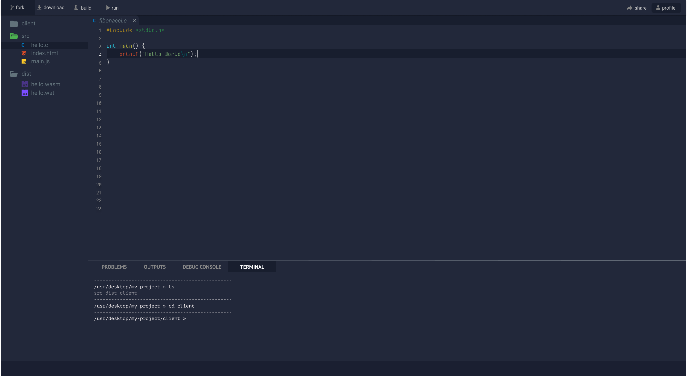

## WEBASSEMBLY PLAYGROUND

Mockup design is [here](https://www.figma.com/file/f59pb6stBuVTJLYulS3n5i9x/wasm-playground?node-id=0%3A1)

This project was bootstrapped with [Create React App](https://github.com/facebook/create-react-app).

This Repository contains the codes for the front-end of the playground.

### Contributing
Contributions are welcome! Front-end developers and designers are welcome to help us in building the interface. How to contribute coming in a minute

### Available commands

`npm start`

Runs the app in development mode. The app runs on port 3000 so in order to use the app, go to [http://localhost:3000](http://localhost:3000).

`npm test`

Runs the test

`npm run build`

It will create a production build that can be used in production (deployed by a server)
